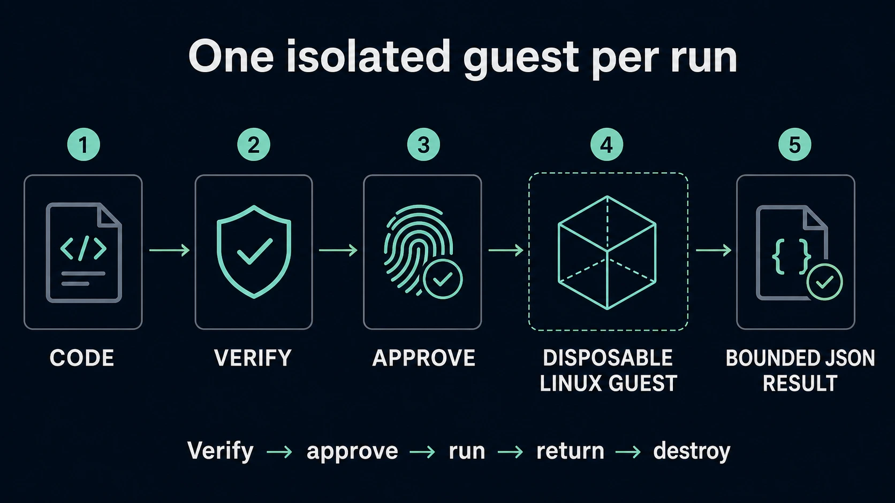

# Capsule

Capsule is an experimental trusted execution platform for bounded modern JavaScript jobs
proposed by AI agents.

[Project site](https://shrimpworks.github.io/capsule-corp/) ·
[Security overview](docs/SECURITY_OVERVIEW.md) ·
[Work status](docs/STATUS_LANGUAGE.md) ·
[Technical design](docs/TECHNICAL_DESIGN.md) ·
[Architecture](docs/ARCHITECTURE.md) ·
[Threat model](docs/security/THREAT_MODEL.md)

> [!WARNING]
> Capsule is an early scaffold. It is not yet a security boundary and must not be used to execute
> hostile code outside another trusted sandbox.

## Core rule

> The agent proposes. The daemon plans and registers exact bytes. The trusted Broker obtains
> human authorization. Only the Execution Supervisor may create a hostile guest.

## Intended architecture



> **Target architecture—not current product status.** Capsule remains an early scaffold and does
> not yet run hostile jobs.

The same trust path in text:

```text
agent / MCP / SDK
        │ untrusted proposal
        ▼
agent-facing Go daemon
        │ exact immutable plan registration
        ▼
Execution Supervisor ◄──── trusted native Broker
        │                   approval + scoped content handles
        ▼
governed libkrun/HVF candidate
        │
        ▼
fresh disposable governed `deno_core` guest per attempt
```

- The daemon has no approval key, user-only content, backend launch path, or grant-reset authority.
- The Broker renders Supervisor-registered plan bytes, requires user presence, and owns user
  content; it cannot launch a guest.
- The Supervisor independently enforces v0 hard safety, consumes one-use approvals, owns backend
  lifecycle/cleanup, and signs an enforcement transcript.
- User receipts compose Broker approval and Supervisor enforcement claims. They are attributable
  evidence, not independent platform attestation.
- The normative local identity is an installation ID plus locally authorized keys. DIDs remain
  first-class optional identifiers for interoperability and exported evidence.
- Pinned TUF roots anchor releases and profiles. Live execution consumes a verified local trust
  snapshot and performs no network trust lookup.

## First executable slice

The initial product slice is deliberately narrow:

- exactly one dependency-free, byte-exact `main.mjs` up to 262,144 bytes;
- inline JSON input and bounded JSON output;
- explicit plan registration and one-attempt user approval;
- no network, subprocess, environment inheritance, native addons, FFI, macros, inspector, package
  installation, arbitrary image, or host/guest path authority;
- fixed low-bandwidth agent summary and user-only full output by default;
- development posture until exact backend controls pass retained adversarial tests.

Regular-file snapshots and broader outputs follow after the authority and content boundaries work.

## Near-term work: contracts plus fail-fast evidence

The first architecture and feasibility program is complete. It selected a bounded deterministic-
CBOR/COSE direction, proved important macOS authority and recovery mechanics, rejected Apple
Containerization as a production backend, and retained libkrun/HVF as the lead native candidate
under evaluation without admitting it.

Work now proceeds on two lanes:

1. Freeze and implement backend-independent contracts, registered-plan/one-use approval state,
   fake-backend recovery/evidence, and bounded inline JSON.
2. Close the exact governed `deno_core`/libkrun successor profile, immutable runtime-root custody,
   physical loader/host-authority omission, typed port transport/completion, and complete installed-
   bundle admission before hostile source enters a guest.

Filesystem-image parsing is deferred until file artifacts, not removed. Prototype code may be
thrown away; reproducible fixtures, observations, limitations, and ADR decisions are retained. See
[Feasibility Spikes](docs/FEASIBILITY_SPIKES.md), the
[Gate C P0 reconciliation](docs/GATE_C_P0_RECONCILIATION.md), and the [Roadmap](docs/ROADMAP.md).

## Repository layout

```text
cmd/capsuled/          Go daemon scaffold
internal/              Current trusted control-plane scaffold
packages/protocol/     Pre-freeze scaffold and passive candidate TypeScript views
packages/sdk/          TypeScript client SDK
packages/mcp-server/   MCP adapter scaffold
profiles/              Draft runtime profile declarations
schemas/               Current scaffold plus passive JSON/CDDL candidates and fixtures
docs/                  Project, design, security, ADRs, spikes, and roadmap
site/                  Minimal project overview site
```

Completed disposable spikes and one-time harnesses are retained in the separate
[`Shrimpworks/capsule-experiments`](https://github.com/Shrimpworks/capsule-experiments)
archive. This repository keeps canonical decisions and product conformance fixtures, not archived
prototype implementations.

## Technology direction

- Go for the agent-facing daemon and orchestration.
- Swift/native macOS for the Trusted Host Broker.
- Supervisor language and privilege model selected by feasibility evidence; no host-root assumption.
- TypeScript for current protocol/client scaffolding; the first guest workload is modern `.mjs`.
- JSON Schema Draft 2020-12 for wire contracts after replacement/freeze.
- Proposed SHA-256 + bounded deterministic CBOR/COSE Sign1 profile, gated by object-specific
  cross-language fixtures and review.
- Secure Enclave/Keychain and XPC code requirements for compatible macOS authority boundaries.
- Governed minimal `deno_core` as the first guest runtime candidate, contingent on the composed P0
  authority corpus and exact profile admission.
- Native libkrun/HVF as the lead Apple candidate under evaluation, Apple Containerization as
  development-only, and OCI plus gVisor as an independent comparison/contingency.
- TUF-style release/profile trust with compact verified local trust snapshots.
- pnpm, TypeScript, Biome, Go tooling, Make, and GitHub Actions for development and CI.

Go, Swift, Rust, cryptography, and language-runtime permissions do not replace the external hostile-
guest boundary. See [ADR-0005](docs/adr/0005-go-control-plane.md) and
[ADR-0018](docs/adr/0018-platform-specific-trusted-components.md).

## Status

The repository contains specifications and buildable scaffolding. It does not start guest runtimes.
Current schemas/types remain canonical for current tests but are explicitly not the intended final
v0 protocol; see [Schema status](schemas/README.md).

The ordered path is now:

1. Reconcile the completed spike evidence and freeze backend-independent contracts.
2. Prove registered-plan/approval/recovery with a fake backend and close one fixed benign owned
   guest as a separate engineering checkpoint.
3. Compose the exact developer-signed owner-only alpha: authenticated CLI, native Broker, atomic
   source custody, one fresh guest per attempt, and fixed Supervisor-derived summaries.
4. Run the composed hostile `.mjs`, authority-denial, transport, root, lifecycle, teardown, and
   restoration corpus before calling the owner-only profile an internal alpha.
5. Add file snapshots and disposable bounded artifact parsing only after the inline-only alpha.
6. Complete production storage, distribution, replacement, and multi-host evidence before an
   external alpha.

See [Documentation](docs/README.md) for the complete design set.

## Development

Prerequisites:

- Go 1.23 or newer
- Node.js 22.22.1 for repository tooling
- pnpm 10.28.2
- Bun 1.3.14 for runtime-profile experiments; it is not an admitted workload profile

```bash
pnpm install
make ci
```

See [Development](docs/DEVELOPMENT.md). Before publishing or transferring the repository, follow
the [GitHub repository setup checklist](docs/REPOSITORY_SETUP.md).

AI-agent context is documented in [.codex/AI_CENTRAL.md](.codex/AI_CENTRAL.md). `AGENTS.md`
remains authoritative for Capsule-specific contribution rules. Run `pnpm codex:links` to create the
ignored local AI Central, Caveman, and Hallmark links.

## Support and security

Use [SUPPORT.md](SUPPORT.md) for development questions. Report suspected vulnerabilities privately
according to [SECURITY.md](SECURITY.md).

## License

Capsule-owned material is licensed under the [Apache License, Version 2.0](LICENSE). Third-party
components and retained artifacts remain under their respective licenses; see
[Licensing](docs/LICENSING.md) and [Third-party notices](THIRD_PARTY_NOTICES.md).
