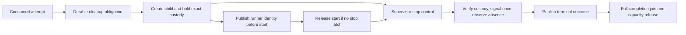

# C5b17 teardown-intent and deadline design

Date: 2026-09-06

Status: passive design and independent review `PASSED` / **Ready** (instance 1 of 3).
Canonical verification: `PASSED` for required CI gates; existing full-revive backlog
reported below.
Parent owner-only alpha: `IN_PROGRESS — TRENDING_GOOD`.
Runnable successor, installed lifecycle, guest execution and product admission: `BLOCKED`.
ADR-0047 lifecycle: **Proposed**, not Accepted.

## Scope and acceptance

This task owns one canonical documentation PR. Defensive analysis is confined to
Capsule source and the exact owned benign experiment archive. It runs no new
fixture, guest, interpreter, service or dependency experiment. Historical timing
is retained evidence, not a fresh run or a platform timing guarantee.

Acceptance: trace every storage dependency before signal and absence; specify
clock/custody/failure obligations and compare alternatives; retain a reviewed
proposal and bounded next verification gate. Existing formats, authority and
runtime behavior remain unchanged.

[C5b16 PR #363](https://github.com/Shrimpworks/capsule-corp/pull/363) merged at
`500892e8a1c4a0a4808a1b326a6acd71b47411d2`.
[Archive PR #37](https://github.com/Shrimpworks/capsule-experiments/pull/37) merged at
`d8fd74a158f2227277ccfce5532e9bd8ad3e714e`; the reviewed source/evidence pin stays
`0efd03def6bc333a92c8b9809bc56b7b3ce9ea80`. Merge does not replace that identity.

## Current storage dependency chain

All archive links below use that immutable pin under
[typed-guest-transport-c5b16-timing-fault](https://github.com/Shrimpworks/capsule-experiments/tree/0efd03def6bc333a92c8b9809bc56b7b3ce9ea80/experiments/typed-guest-transport-c5b16-timing-fault).
Generated C5b16 symbols derive from the retained C5b11/C5b13 source names.

| Location / operation | Dependency and consequence |
| --- | --- |
| [Driver `reconcile_created_attempt`](https://github.com/Shrimpworks/capsule-experiments/blob/0efd03def6bc333a92c8b9809bc56b7b3ce9ea80/experiments/typed-guest-transport-c5b16-timing-fault/inputs/supervisor_effect_driver.c) | Effects 14 and 15 fence and look up the fenced attempt before effect 16 requests teardown. Each may publish; failure can route to effect 21 unresolved publication before any signal. |
| [Bridge `BridgeApply`](https://github.com/Shrimpworks/capsule-experiments/blob/0efd03def6bc333a92c8b9809bc56b7b3ce9ea80/experiments/typed-guest-transport-c5b16-timing-fault/source/bridge/owner.go) | Global bridge mutex spans each store operation. After uncertainty, close/open and state validation also precede recovery. A second caller alone cannot bypass these dependencies. |
| [Store transitions](https://github.com/Shrimpworks/capsule-experiments/blob/0efd03def6bc333a92c8b9809bc56b7b3ce9ea80/experiments/typed-guest-transport-c5b16-timing-fault/source/store/transitions.go) | `begin/requireCurrent` checks ownership and rereads state. `Fence`, first `LookupFenced`, `BeforeTeardown`, advancing checkpoints and `RecordUnresolved` publish under the store mutex. Some replay paths read without publishing. |
| [Store `publish` and `readExisting`](https://github.com/Shrimpworks/capsule-experiments/blob/0efd03def6bc333a92c8b9809bc56b7b3ce9ea80/experiments/typed-guest-transport-c5b16-timing-fault/source/store/files.go) | Ownership/stat/directory enumeration/open/read/decode precede writes; revalidation, exclusive temporary-file creation, write/sync/close, rename, directory open/sync/close and final stat precede success. Aborted writes may remove the temporary file; reopen also acquires the owner lock. No kernel latency bound follows from finite bytes. |
| [Native teardown and reconciliation](https://github.com/Shrimpworks/capsule-experiments/blob/0efd03def6bc333a92c8b9809bc56b7b3ce9ea80/experiments/typed-guest-transport-c5b16-timing-fault/source/native/lifecycle.c) | Effect 16 waits for `BeforeTeardown`, then starts the local 1,000-ms clock and signals its owned child. Effects 17–19 call storage checkpoints before reap, terminal and absence checks. Effect 20 checkpoints before root removal. |
| Durable completion and delivery | Effects 12/13 and recovery 22/23 remain storage-dependent after physical absence. Removing them from a stop path cannot turn uncommitted observations into public results or capacity release. |

C5b16 injected delays only at spawn/teardown publication edges. It did not measure
all the other listed operations independently. Its teardown-request anchor is
after driver fencing/lookup, so its measured total excludes those earlier waits.
Their presence is a source-derived dependency, not a measured latency finding.

## Proposed clock anchors

[C2A](protocol/GOVERNED_DENO_CORE_C2A_EXECUTION_PROFILE.md#teardown-and-success)
requires wall action at 1,000 ms, immediate cancellation, at most 200 ms best-effort
grace, forced absence within 1,000 ms and at most 1,200 ms from initial action.
The following precise successor anchors are proposals, not changes to frozen bytes.

| Symbol | Proposed meaning |
| --- | --- |
| `t_start` | Supervisor monotonic timestamp immediately before attempting the first start-token write, after confirmed durable attempt/runner identity binding. Partial or lost start acknowledgement never resets it. |
| `t_wall` | `t_start + 1,000 ms`; lateness in servicing the deadline never moves this anchor. |
| `t_cancel` | Supervisor ingress timestamp of an authenticated, attempt-bound cancellation accepted by the control path, before any storage wait. Caller timestamps confer no authority. Pre-start cancellation prevents start and applies to any already owned gated runner. |
| `t_action` | Earliest applicable wall, accepted cancellation or Supervisor-detected fatal-fault anchor. Repeated requests/faults never extend it. Transport-to-Supervisor cancellation latency requires separate evidence. |
| `t_force` | First forced-teardown request after exact custody/identity checks. Proposed first successor uses no grace; it must service the request immediately, with all dispatch/identity latency included in the total. |
| `t_absent` | Supervisor's authoritative absence observation for the exact runner and required child tree. A signal return, EOF, harness alarm or root removal is not this observation. |

Both `t_absent <= t_force + 1,000 ms` and
`t_absent <= t_action + 1,200 ms` must hold; neither budget restarts after a store
response. These are independent upper bounds, not 2,200 ms of combined allowance.
Failure to observe absence by either deadline is a failed timing case and unresolved
lifecycle; later absence cannot retroactively pass it. Continue only already
permitted reconciliation, without repeating an uncertain signal.

The earlier setup deadline remains separate and never turns an unstarted/gated
runner into an unlimited lifetime. Cancellation must remain serviceable from the
first exact custody observation. Spawn ambiguity or identity mismatch permits no
signal and no absence claim. No clock value survives restart as a renewed budget.
Clock failure, suspend/wake behavior and host scheduling stalls require an explicit
successor clock policy and evidence; elapsed sleep or a fresh timer cannot fill
that gap.

## Ordering proposal

[Proposed ADR-0047](adr/0047-prepare-teardown-obligation-before-launch.md) proposes a
precommitted, attempt-bound cleanup obligation and a Supervisor control path whose
progress is independent of store work. Preparation and later observed outcomes
remain separate facts. Merely moving `BeforeTeardown` before spawn is insufficient:
shared locks, early fence writes and checkpoint-before-reap ordering must also be
removed from the stop dependency chain in a versioned successor.

The stop path must remain available while runner-identity publication is pending;
start stays closed. An unavailable/failed terminal store holds capacity and output,
even after local physical absence is known. Bounded storage work cannot grow a
queue, reuse an attempt or silently install another owner. No implementation of
this scheduling separation or durable record is selected by this document.

## Failure and recovery matrix for the next passive slice

| Case | Required successor disposition |
| --- | --- |
| Preparation pending, failed or indeterminate before creation | No spawn/start. Reopen complete old/new state for classification only; do not blindly retry creation or treat a lost acknowledgement as confirmed preparation. |
| Preparation confirmed; crash before creation | Retained obligation is conservative may-exist state on restart; no restored PID custody, automatic signal, fresh attempt or completion. |
| Child created; runner-identity publication pending/refused | Start remains closed. Live Supervisor's prepared stop obligation and exact custody govern cancellation/cleanup independently of the write. |
| Stop while any post-create write holds its lock | Stop latch and native identity/signal/reap path progress without acquiring that lock; storage outcome remains pending or indeterminate. |
| Late write response after stop, failure or absence | Cannot release start, clear a monotonic fence/stop latch, alter first terminal observations or release capacity; reconcile generation and exact operation before settling. |
| Storage failure with live exact process custody | Prepared cleanup remains available; retain failure and withhold durable completion. Unknown process identity remains a separate no-signal condition. |
| Signal response lost or uncertain | Never redrive the non-repeatable request. Reconcile with exact live custody; missing absence remains unresolved. |
| Absence observed; terminal publication fails | Physical absence fact remains local; public completion, output and capacity stay withheld until a valid durable terminal join. |
| Supervisor death, lost reaper, PID reuse, identity mismatch | Preparation alone supplies no signal authority over an observed PID. Preserve unresolved obligation and block admission; installed recovery remains unproven. |
| Repeated cancel, wall and fatal-fault race | One stop latch, earliest anchor, no clock reset or extra signal; no resurrection by a late success. |

## Milestones and decision gate

1. **C5b17 passive proposal:** source dependency map, alternatives, clock/failure
   obligations and independent review. No new experiment or runtime effect.
2. **C5b18 passive successor specification/model:** close record fields/version,
   operation identity and start/stop ordering; model one outstanding write,
   late-response settlement, all matrix cases, earliest clocks and crash states.
   Acceptance requires independent derivation and mutations restoring a storage
   wait, permitting late start, repeating a signal, forgetting preparation,
   resetting a deadline, adopting a PID after restart or committing before absence.
   No process/guest execution. Maintainer acceptance of ADR-0047 is a separate gate
   after that concrete packet is reviewable.
3. **Later bounded benign experiment:** only after the accepted decision and a
   reviewed exact implementation plan, validate the selected scheduling/custody
   mechanism with pinned fixed children in owned disposable local directories.
   Retain blocked-write, refusal, late-completion and race evidence plus mutation
   tests in `Shrimpworks/capsule-experiments`. No deadline widening or guest scope.

A model establishes logical ordering, not scheduler/kernel latency or installed
custody. Runner/profile composition, protected state, restart/tree custody and
actual guest validation remain separate downstream gates. No new dependency or
primitive is adopted; a later mechanism selection must complete the ecosystem
reuse/adoption checklist in its consuming slice.

## Verification and review

Independent review instance 1 of 3 returned **Ready**, with no actionable findings.
The following is a condensed record of the reviewer report, not new runtime evidence:

- Blind preliminary pass preceded the author explanation. Six frozen document
  hashes matched the declared dirty scope at base `500892e8a1c4a0a4808a1b326a6acd71b47411d2`.
- All 181 relative links and `git diff --check` passed. Five archive source files
  and timing evidence matched their exact pinned Git blobs (six byte comparisons).
- Reviewer inspected 38 retained timing runs and ten mutations: all 12 successful
  1,200/1,600-ms delayed teardown runs exceeded 1,200 ms total while post-gate absence
  stayed below 1,000 ms; eight refusal/alarm runs claimed no signal, native absence
  or completion. No native fixture or product suite was executed by the reviewer.
- Source dependencies, proposed authority/custody separation, alternatives and
  next model gate matched the plan. Atomic start/stop ordering, pending-write
  settlement, complete clock policy and platform custody remain future obligations.
- Orchestrator disposition: **Accept** the Ready verdict; no findings require
  correction or deferral. No further review instance is needed for status/publication
  metadata updates. ADR-0047 remains Proposed.

Parent-run verification used Node 22.22.1, pnpm 10.28.2 and Go 1.25.13:
`pnpm install`, `pnpm check`, `pnpm lint`, `pnpm test`, `pnpm verify:schemas`,
`pnpm verify:adrs`, `go test ./...`, `go vet ./...`, `go build ./...`, and
`go run golang.org/x/vuln/cmd/govulncheck@v1.6.0 ./...` passed; no vulnerabilities found.
`golangci-lint run ./...` reported 50 pre-existing revive documentation findings.
`golangci-lint run --disable revive ./...` and the new-code documentation ratchet
`golangci-lint run --enable-only revive --new-from-rev=origin/main ./...` passed.
Final ADR verification covers 47 files; relative links and diff whitespace pass.

Source conclusions reference immutable archive bytes; C5b16 timing runs have not
been repeated for this passive task. Review/check completion does not accept ADR-0047.
