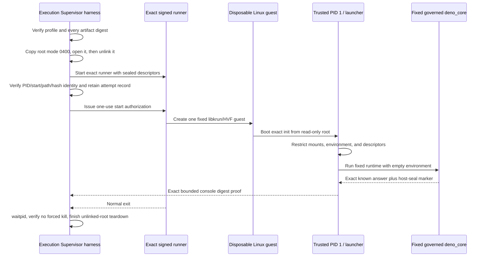

# First owned guest execution checkpoint

- Date: 2026-08-06
- Environment: one owner-controlled Apple-silicon development Mac
- Checkpoint scope: one fixed benign governed-`deno_core` fixture in one disposable local
  libkrun/HVF guest

## Status at a glance

| Dimension | Status | Meaning |
| --- | --- | --- |
| Exact v19 fixed-owned-guest attempt | `PASSED` | The registered fixed fixture booted, ran, produced its exact bounded proof, exited, was reaped, and had its unlinked root torn down. |
| Controlled denial-test v20 no-launch materialization | `PASSED` | Two independent builds reproduced the exact network-disabled root, signed runner, profile, and controller; static validation found only the named local denial probes. No guest was launched. |
| Controlled denial-test v20 execution | `BLOCKED` | Dynamic execution requires a fresh exact one-use authorization naming v20's attempt and composed-profile digest. |
| Governed runtime and libkrun composition | `IN_PROGRESS — TRENDING_GOOD` | The first real composition worked, but the intended typed transport, installed profile, hostile corpus, and final admission evidence remain incomplete. |
| Runtime/backend product admission | `BLOCKED` | No runtime, backend, profile, or product path is admitted by this checkpoint. |
| Owner-only hostile-`.mjs` internal alpha | `IN_PROGRESS — TRENDING_GOOD` | This checkpoint retires one important uncertainty; authenticated submission, real approval, installed authority, arbitrary approved source, durable completion, recovery, and the minimum hostile corpus remain. |

## The milestone

Capsule crossed an important boundary: its governed runtime and native macOS isolation candidate
were no longer only schemas, static artifacts, passive contracts, or isolated library tests. One
exact, Supervisor-authorized, owned-disposable Linux/arm64 guest actually booted through
libkrun/Hypervisor.framework, ran Capsule's fixed `deno_core` known answer, returned an exact
bounded proof, exited normally, and was independently reaped and torn down.

That makes this a real execution checkpoint, not a simulated backend result. It is also deliberately
smaller than an alpha. The workload was fixed and benign, the runner was an experimental local
artifact, and the completion proof used a diagnostic console path rather than the intended final
typed completion channel. The result proves that the basic pieces can work together; it does not
prove that arbitrary hostile source is safely contained or that any profile is ready for users.

## What ran

The successful attempt was:

| Field | Exact value |
| --- | --- |
| Attempt ID | `capsule-c2b-v19-immutable-fixture-benign-owned-guest-20260806-01` |
| Composed-profile digest | `ac2721719a1e4f15c664e0b7c21d99602b6fc7d5a9c55c8b17d08970098f48fa` |
| Materialized profile SHA-256 | `44dcb00d87db91a753beabcc3071ca7b8b6d308fa293b1b9c799c60c4faa3a0b` |
| Signed experimental runner SHA-256 | `df0d7a96b21fae03a5fe50f0afe7551e8b5706adab219fcdfc7c26caf940173c` |
| Guest root SHA-256 | `89b321877bfb2323b11a0eb2e264d3aaffcd2c63702a524b53f55d41ec828c43` |
| Controller SHA-256 | `c4c6fc31dc82df7bb4a4cfc809321a8a78c2eb8f66d50b35b9e80e57135cc70c` |
| Kernel-console proof SHA-256 | `569e4e99fcc396db75a59ae7847e610060e22d7a8b521daec822f780f947baf9` |
| Expected completion-frame SHA-256 | `544d3d32b0923cd63608041fd8c80103f7d8429afd89416bc078e0e5c5fe3542` |
| Authorization to result | 221 ms |
| Supervisor teardown | 5 ms |

The preflight record fixed `maximumGuests` to one and recorded `networkAuthorized: false`,
`credentialsAuthorized: false`, and `arbitraryWorkload: false`. The profile and every consumed
artifact were verified by byte length and SHA-256 before the runner was started.

The v19 profile is an evidence-led experimental successor to the immutable C2B v4 build/static
checkpoint. It does not rewrite v4 or mean that v4 itself was executed. In particular, v19 used an
immutable in-root source/input fixture and bounded console digest proof after the intended
multiport route failed in this direct-root experiment. That distinction is why C2 transport and
product admission remain blocked.

## How the run worked

### Supervisor-side authorization and custody

The development controller acted as the only guest owner for this experiment. It:

1. required the exact profile, runner, current-source libkrun, libkrunfw, root, source, input,
   completion frame, identity helper, attempt ID, and evidence directory;
2. rejected any byte-count, digest, mode, path, host-platform, or evidence-path mismatch before
   guest authorization;
3. copied the root to a mode-`0400` attempt object, opened it, unlinked its pathname, and verified
   link count zero before launch;
4. started one runner with an empty environment and a closed descriptor manifest;
5. independently bound the live runner's PID, parent PID, start time, uid/gid, executable path,
   device/inode, and SHA-256 before committing the attempt record;
6. authorized VM entry only after that durable-before-start record existed; and
7. bounded output, waited for the exact runner, avoided force-kill on the passing path, and retained
   teardown facts separately from guest-reported success.

This was a development Supervisor harness, not the installed product Supervisor or the full human
Approval Broker flow. The user still issued a fresh one-use authorization naming the exact v19
composed digest before execution.

### Guest boot and authority reduction

The exact static trusted init ran as PID 1. It accepted only the fixed kernel-provided environment,
then:

- remounted the direct-block root read-only with `nosuid,nodev`;
- remounted the pre-existing `devtmpfs` with `nosuid,noexec`;
- created a fresh `proc` mount with `nosuid,nodev,noexec`;
- closed every inherited descriptor;
- rebuilt only descriptors 0 through 5 from fixed guest devices and immutable mode-`0444`
  source/input files; and
- executed one fixed launcher with an empty environment.

No live host path was passed into the guest. The source and input were immutable, content-addressed
copies inside the read-only root.

### Fixed runtime and result proof

The launcher revalidated the exact source and input frames, ensured there were no unexpected
descriptors, and started only the fixed governed-`deno_core` executable. The runtime construction
used its custom snapshot, no module loader, no extensions, no inspector, the exact three bootstrap
ops, `--jitless`, disabled string code generation, and the point-in-time no-new-privileges/TSYNC
syscall seal retained by the governed runtime work.

The launcher drained bounded stdout and stderr concurrently, required successful runtime exit,
required the `CAPSULE_HOST_SEAL_ACTIVE` marker, compared stdout to the exact known-answer JSON, and
then wrote a fixed ASCII SHA-256 proof for the expected completion frame to the bounded console.

The complete 428-byte logical console matched exactly. It included successful root/device/proc
setup, descriptor reconstruction, launcher handoff, runtime start/wait/success, and the exact
completion digest.

## Why the iterations mattered

The passing v19 run was not produced by weakening a failing check. Each preceding attempt retained
the failure, changed one evidence-supported assumption, and kept the launch fail-closed.

| Slice | Observation | Consequence |
| --- | --- | --- |
| v10 | Direct root, PID 1, and console boot were real; a generic filesystem-mount step failed. | Replace the generic failure with mount-specific diagnostics. |
| v11 | Root remount succeeded; a duplicate `devtmpfs` mount failed with `EBUSY` because libkrun had already mounted it. | Remount the existing `/dev` instead of creating it. |
| v12 | A stale runner identity in the new profile was rejected before guest start. | Correct the exact runner identity; fail-closed preflight worked as designed. |
| v13-v14 | `/dev` remount worked, but the selected explicit console path did not produce a usable completion stream. | Diagnose exact guest port/device realization rather than treating silence as success. |
| v15-v17 | The expected `vport` nodes never appeared in the direct-root guest, even with bounded waits. | Mark that multiport path `NO_GO` for this experiment only; do not generalize it to the governed final transport. |
| v18 | Immutable in-root source/input plus bounded `hvc0` proof reached the trusted init and launcher; remounting nonexistent `/proc` returned `EINVAL`. | Create a fresh fixed `proc` filesystem instead of remounting it. |
| v19 | Fresh `proc` mount, fixed Deno run, exact console proof, normal exit/reap, and root teardown all passed. | Record the fixed benign owned-guest checkpoint as `PASSED` in its exact scope. |

The sequence is as important as the final green result. It demonstrated that stale identity,
mount-shape, and transport assumptions stopped before or during the single disposable attempt and
that the controller did not reinterpret partial output or exit alone as success.

## What this checkpoint validates

For this exact owned Mac, local artifacts, and fixed fixture, the evidence supports these narrow
statements:

- a Supervisor-owned runner can load the selected libkrun/HVF stack and boot the exact disposable
  direct-root Linux guest;
- the read-only root, trusted PID 1, fixed launcher, and governed `deno_core` fixture can compose;
- fixed immutable inputs can reach the launcher without a live host filesystem mapping;
- the expected runtime known answer and host-seal marker can be checked under bounded drains;
- a fixed digest proof can traverse the bounded console and match an exact full-console oracle;
- runner identity can be bound before VM authorization;
- normal runner exit can be authoritatively reaped without force-kill; and
- an already-unlinked attempt root can reach final link count zero during bounded teardown.

This materially reduces feasibility risk. It is the first evidence in this workstream that all of
those mechanisms operated in one real guest attempt.

## What this checkpoint does not validate

This result must not be shortened to “Capsule is secure” or “the alpha is ready.” It does not show:

- arbitrary, user-supplied, or hostile `.mjs` execution;
- the installed product's authenticated IPC, human Broker rendering/signing, protected state,
  one-use grant consumption, or recovery path;
- Developer ID signing, notarization, Gatekeeper, App Sandbox, Hardened Runtime, clean-host, or
  supported-minimum-macOS evidence;
- the final three-port typed source/input/completion transport or its hostile VMM/queue/descriptor
  corpus;
- an exact binary completion frame returned to the Supervisor—the result record honestly has
  `completionExact: false` and `completionBytes: 0`; only the complete fixed console digest proof
  has `consoleProofExact: true`;
- resource guarantees beyond the exact configured guest values and observed wall/teardown bounds;
- hostile guest-kernel containment, VM escape resistance, microarchitectural noninterference, or
  repeated/concurrent/soak behavior;
- runtime or backend admission, a release artifact, product wiring, or an alpha release; or
- durable archive publication of the raw v10-v19 experiment harness and evidence.

The final item is an evidence-retention blocker, not a reason to erase the checkpoint. Raw local
evidence remains in the owner-controlled disposable experiment workspace. Before this result is
used as durable release or admission evidence, the harness, selected logs, manifests, and
validation report must be published to `Shrimpworks/capsule-experiments`, verified, and linked here
at an exact immutable archive commit.

## The next controlled experiment

The next slice is intentionally adversarial but still fixed, local, bounded, credential-free, and
non-networking. Its no-launch materialization is `PASSED`; dynamic execution is `BLOCKED` on a
fresh exact one-use authorization.

The v20 candidate first repeats the exact passing Deno known answer. It then irreversibly changes
the guest process to uid/gid 65534 with no-new-privileges and zero effective capabilities before
executing a fixed native denial probe. The probe sends no network traffic and attempts only named
local controls:

- mutate a mode-`0666` file on the read-only guest root;
- mount a filesystem;
- regain uid 0;
- observe fixed host-only paths;
- open guest block devices for writing;
- create a vsock endpoint without connecting or sending;
- find a non-loopback interface or default route; and
- find a virtiofs or host-path mount.

Every unexpected success fails the attempt. Independent A/B construction reproduced the root and
guest binary byte-for-byte, reproduced the signed runner and profile byte-for-byte, verified both
runner signatures strictly, and produced the same controller in two clean builds. Static
source/control/sink validation found no `connect`, `send`, `sendto`, `sendmsg`, HTTP, TCP, UDP, or
`AF_INET` surface in the probe. The fixed candidate is bound as follows:

| Field | Exact value |
| --- | --- |
| Attempt ID | `capsule-c2b-v20-hostile-denial-owned-guest-20260806-01` |
| Composed-profile digest | `29bfd640b5b53ef94cc54aea1ed1ff9813b569fc11b06bb7105bbf5b032d71a9` |
| Materialized profile SHA-256 | `543d9967835577ef162ab5b765cac78a2e63367f68083d0e7b9c5facbe40ed34` |
| Signed experimental runner SHA-256 | `76793d6159c22d66782239b91cf4b1d23c98d0591ceeaa81d50ad6fafeb45ab1` |
| Guest root SHA-256 | `06b18229ca215282c7aa405dc6b2d942291cecf613a111f21c03bd7a750808ab` |
| Fixed denial probe SHA-256 | `d71c62cbc149f684ddbf836b57981f834f02ea6ee04344282e5cfd12864dbb52` |
| Controller SHA-256 | `427508912de0968f881c3cf46a48c852467139b14972079b5d9cd2eaee6bdbdf` |

No runner, libkrun/HVF process, or v20 guest was executed during materialization, and no v20
evidence directory exists. The validation report and receipt currently remain in the disposable
local experiment workspace, so they are not durable release or admission evidence. Exact v20
execution must refuse any changed attempt, digest, path, binary, or authority and must not launch
until a fresh authorization names the values above.

Even a passing v20 experiment will remain a controlled denial checkpoint, not the owner-only
hostile-`.mjs` internal alpha. The alpha requires the complete installed authority path and the
minimum hostile source, transport, lifecycle, recovery, response-loss, and restoration corpus in
the exact admitted profile.

## Project consequence

The fixed benign owned-guest step in [ADR-0040](adr/0040-freeze-owner-only-internal-alpha-posture.md)
is now `PASSED` for the exact v19 experimental scope. The parent workstreams remain active because
the experiment deliberately used a fixed known answer and a diagnostic completion mechanism.

The practical consequence is still substantial: Capsule no longer has to ask whether a governed
`deno_core` fixture, a direct read-only root, a narrow libkrun/HVF runner, and Supervisor-owned
lifecycle can work together at all on the owned development Mac. They did. The next questions are
whether the boundary refuses the fixed denial corpus, whether the intended typed transport can be
closed, and whether the same ordering survives the real installed approval, attempt, recovery, and
completion path.
