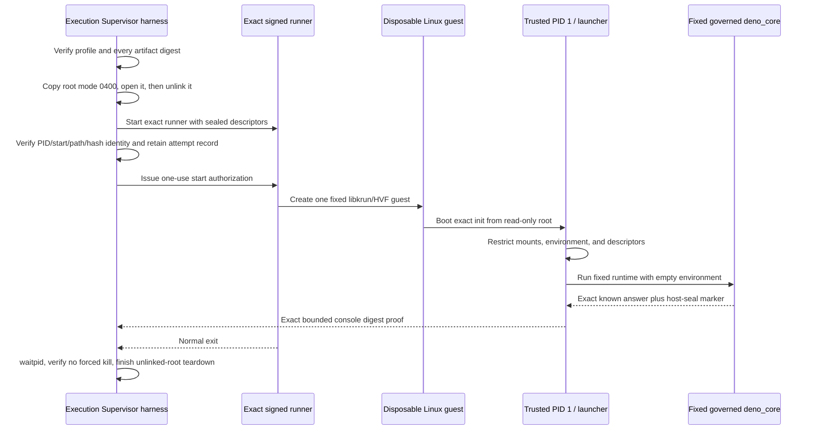

# First owned guest execution checkpoint

- Date: 2026-08-06
- Environment: one owner-controlled Apple-silicon development Mac
- Checkpoint scope: one fixed benign governed-`deno_core` fixture in one disposable local
  libkrun/HVF guest

## Status at a glance

| Dimension | Status | Meaning |
| --- | --- | --- |
| Exact v19 fixed-owned-guest attempt | `PASSED` | The registered fixed fixture booted, ran, produced its exact bounded proof, exited, was reaped, and had its unlinked root torn down. |
| Controlled denial-test v20 no-launch materialization | `PASSED` | Two independent builds reproduced the exact network-disabled root, signed runner, profile, and controller; static validation found only the named local denial probes. No guest was launched. |
| Controlled denial-test v20 execution | `BLOCKED` | The exact runner refused with exit 125 before readiness. No start authorization or guest launch occurred, and missing persisted early stderr leaves the failing pre-ready stage unknown. |
| Controlled denial-test v21 diagnostic materialization | `PASSED` | A fixed source/build-only successor added bounded pre-ready stage labels and early-stderr persistence without adding authority. |
| Controlled denial-test v21 execution | `BLOCKED` | The ready pipe reached EOF before `R`; no start authorization or guest launch occurred. Controller selection returned before stderr drain and authoritative waitpid evidence persisted. |
| Controlled denial-test v22 convergence materialization | `PASSED` | A fixed source/build-only successor converges every non-`R` result through bounded wait, stderr persistence, waitpid evidence, and canary verification. No v22 runner or guest was executed. |
| Controlled denial-test v22 execution | `BLOCKED` | Exact retained stderr localized exit 125 to `preflight-root-sha256`; no ready byte, authorization, libkrun configuration, HVF call, or guest launch occurred. Host-only hashing matches the expected root, so the inherited-FD/hash-state cause remains unresolved. |
| Controlled denial-test v23 root-digest localization | `PASSED` | One exact authorized invocation proved the staged path, unlinked open FD, runner-computed digest, and actual root all agree. The embedded expected byte array was malformed beginning at zero-based byte 18. |
| Controlled denial-test v23 hostile execution | `BLOCKED` | The runner refused before ready/authorization/libkrun/HVF/guest activity, so no denial-control result exists. |
| Controlled denial-test v24 early denial controls | `PASSED` | One exact authorized guest reproduced the known answer and proved non-root/no-new-privileges/zero capabilities, sealed descriptors, read-only-root refusal, absent host paths, mount refusal, and root-regain refusal. |
| Controlled denial-test v24 complete corpus | `BLOCKED` | The probe stopped generically in the vsock-check family before its expected marker. No connection or send occurred, but the exact socket/device sub-branch and all later controls remain unknown. |
| Controlled denial-test v25 runtime candidate | `NO_GO` | Pre-launch semantic review showed socket creation alone is not usable vsock/network authority, so v25 tested the wrong property. It was not authorized or launched. |
| Controlled denial-test v26 failure localization | `PASSED` | One exact guest passed active local-CID vsock-unavailable and raw-block write-open denial, then reported the fixed reason `non-loopback guest network interface is present`. |
| Controlled denial-test v26 complete corpus | `BLOCKED` | The probe rejected expected down/unbacked `dummy0` by name before evaluating flags, backing, or routes. This is a probe-policy mismatch, not network-access evidence; v26 must not be rerun. |
| Exact v27 fixed hostile-denial attempt | `PASSED` | One exact authorized owned guest completed all 30 expected markers, exact completion and console proofs, every fixed denial control, normal reap, unlinked-root teardown, and unchanged canary with zero network/credential authority or traffic. |
| Raw v10-v27 archive retention | `BLOCKED` | Canonical conclusions and exact identities remain in Capsule, but the unpublished 280-file local archive commit/workspace is unavailable locally and remotely. Recovery requires an owner-supplied backup; otherwise new durable evidence requires a separately authorized rerun. |
| Governed runtime and libkrun composition | `IN_PROGRESS — TRENDING_GOOD` | V27 closes the exact fixed hostile-denial experiment. Final typed transport, installed composition/recovery, broader lifecycle and platform matrices, independent admission review, and product wiring remain incomplete. |
| Runtime/backend product admission | `BLOCKED` | No runtime, backend, profile, or product path is admitted by this checkpoint. |
| Owner-only hostile-`.mjs` internal alpha | `IN_PROGRESS — TRENDING_GOOD` | This checkpoint retires one important uncertainty; authenticated submission, real approval, installed authority, arbitrary approved source, durable completion, recovery, and the minimum hostile corpus remain. |

## The milestone

Capsule crossed an important boundary: its governed runtime and native macOS isolation candidate
were no longer only schemas, static artifacts, passive contracts, or isolated library tests. One
exact, Supervisor-authorized, owned-disposable Linux/arm64 guest actually booted through
libkrun/Hypervisor.framework, ran Capsule's fixed `deno_core` known answer, returned an exact
bounded proof, exited normally, and was independently reaped and torn down.

That makes this a real execution checkpoint, not a simulated backend result. It is also deliberately
smaller than an alpha. The workload was fixed and benign, the runner was an experimental local
artifact, and the completion proof used a diagnostic console path rather than the intended final
typed completion channel. The result proves that the basic pieces can work together; it does not
prove that arbitrary hostile source is safely contained or that any profile is ready for users.

## What ran

The successful attempt was:

| Field | Exact value |
| --- | --- |
| Attempt ID | `capsule-c2b-v19-immutable-fixture-benign-owned-guest-20260806-01` |
| Composed-profile digest | `ac2721719a1e4f15c664e0b7c21d99602b6fc7d5a9c55c8b17d08970098f48fa` |
| Materialized profile SHA-256 | `44dcb00d87db91a753beabcc3071ca7b8b6d308fa293b1b9c799c60c4faa3a0b` |
| Signed experimental runner SHA-256 | `df0d7a96b21fae03a5fe50f0afe7551e8b5706adab219fcdfc7c26caf940173c` |
| Guest root SHA-256 | `89b321877bfb2323b11a0eb2e264d3aaffcd2c63702a524b53f55d41ec828c43` |
| Controller SHA-256 | `c4c6fc31dc82df7bb4a4cfc809321a8a78c2eb8f66d50b35b9e80e57135cc70c` |
| Kernel-console proof SHA-256 | `569e4e99fcc396db75a59ae7847e610060e22d7a8b521daec822f780f947baf9` |
| Expected completion-frame SHA-256 | `544d3d32b0923cd63608041fd8c80103f7d8429afd89416bc078e0e5c5fe3542` |
| Authorization to result | 221 ms |
| Supervisor teardown | 5 ms |

The preflight record fixed `maximumGuests` to one and recorded `networkAuthorized: false`,
`credentialsAuthorized: false`, and `arbitraryWorkload: false`. The profile and every consumed
artifact were verified by byte length and SHA-256 before the runner was started.

The v19 profile is an evidence-led experimental successor to the immutable C2B v4 build/static
checkpoint. It does not rewrite v4 or mean that v4 itself was executed. In particular, v19 used an
immutable in-root source/input fixture and bounded console digest proof after the intended
multiport route failed in this direct-root experiment. That distinction is why C2 transport and
product admission remain blocked.

## How the run worked

### Supervisor-side authorization and custody

The development controller acted as the only guest owner for this experiment. It:

1. required the exact profile, runner, current-source libkrun, libkrunfw, root, source, input,
   completion frame, identity helper, attempt ID, and evidence directory;
2. rejected any byte-count, digest, mode, path, host-platform, or evidence-path mismatch before
   guest authorization;
3. copied the root to a mode-`0400` attempt object, opened it, unlinked its pathname, and verified
   link count zero before launch;
4. started one runner with an empty environment and a closed descriptor manifest;
5. independently bound the live runner's PID, parent PID, start time, uid/gid, executable path,
   device/inode, and SHA-256 before committing the attempt record;
6. authorized VM entry only after that durable-before-start record existed; and
7. bounded output, waited for the exact runner, avoided force-kill on the passing path, and retained
   teardown facts separately from guest-reported success.

This was a development Supervisor harness, not the installed product Supervisor or the full human
Approval Broker flow. The user still issued a fresh one-use authorization naming the exact v19
composed digest before execution.

### Guest boot and authority reduction

The exact static trusted init ran as PID 1. It accepted only the fixed kernel-provided environment,
then:

- remounted the direct-block root read-only with `nosuid,nodev`;
- remounted the pre-existing `devtmpfs` with `nosuid,noexec`;
- created a fresh `proc` mount with `nosuid,nodev,noexec`;
- closed every inherited descriptor;
- rebuilt only descriptors 0 through 5 from fixed guest devices and immutable mode-`0444`
  source/input files; and
- executed one fixed launcher with an empty environment.

No live host path was passed into the guest. The source and input were immutable, content-addressed
copies inside the read-only root.

### Fixed runtime and result proof

The launcher revalidated the exact source and input frames, ensured there were no unexpected
descriptors, and started only the fixed governed-`deno_core` executable. The runtime construction
used its custom snapshot, no module loader, no extensions, no inspector, the exact three bootstrap
ops, `--jitless`, disabled string code generation, and the point-in-time no-new-privileges/TSYNC
syscall seal retained by the governed runtime work.

The launcher drained bounded stdout and stderr concurrently, required successful runtime exit,
required the `CAPSULE_HOST_SEAL_ACTIVE` marker, compared stdout to the exact known-answer JSON, and
then wrote a fixed ASCII SHA-256 proof for the expected completion frame to the bounded console.

The complete 428-byte logical console matched exactly. It included successful root/device/proc
setup, descriptor reconstruction, launcher handoff, runtime start/wait/success, and the exact
completion digest.

## Why the iterations mattered

The passing v19 run was not produced by weakening a failing check. Each preceding attempt retained
the failure, changed one evidence-supported assumption, and kept the launch fail-closed.

| Slice | Observation | Consequence |
| --- | --- | --- |
| v10 | Direct root, PID 1, and console boot were real; a generic filesystem-mount step failed. | Replace the generic failure with mount-specific diagnostics. |
| v11 | Root remount succeeded; a duplicate `devtmpfs` mount failed with `EBUSY` because libkrun had already mounted it. | Remount the existing `/dev` instead of creating it. |
| v12 | A stale runner identity in the new profile was rejected before guest start. | Correct the exact runner identity; fail-closed preflight worked as designed. |
| v13-v14 | `/dev` remount worked, but the selected explicit console path did not produce a usable completion stream. | Diagnose exact guest port/device realization rather than treating silence as success. |
| v15-v17 | The expected `vport` nodes never appeared in the direct-root guest, even with bounded waits. | Mark that multiport path `NO_GO` for this experiment only; do not generalize it to the governed final transport. |
| v18 | Immutable in-root source/input plus bounded `hvc0` proof reached the trusted init and launcher; remounting nonexistent `/proc` returned `EINVAL`. | Create a fresh fixed `proc` filesystem instead of remounting it. |
| v19 | Fresh `proc` mount, fixed Deno run, exact console proof, normal exit/reap, and root teardown all passed. | Record the fixed benign owned-guest checkpoint as `PASSED` in its exact scope. |

The sequence is as important as the final green result. It demonstrated that stale identity,
mount-shape, and transport assumptions stopped before or during the single disposable attempt and
that the controller did not reinterpret partial output or exit alone as success.

## What this checkpoint validates

For this exact owned Mac, local artifacts, and fixed fixture, the evidence supports these narrow
statements:

- a Supervisor-owned runner can load the selected libkrun/HVF stack and boot the exact disposable
  direct-root Linux guest;
- the read-only root, trusted PID 1, fixed launcher, and governed `deno_core` fixture can compose;
- fixed immutable inputs can reach the launcher without a live host filesystem mapping;
- the expected runtime known answer and host-seal marker can be checked under bounded drains;
- a fixed digest proof can traverse the bounded console and match an exact full-console oracle;
- runner identity can be bound before VM authorization;
- normal runner exit can be authoritatively reaped without force-kill; and
- an already-unlinked attempt root can reach final link count zero during bounded teardown.

This materially reduces feasibility risk. It is the first evidence in this workstream that all of
those mechanisms operated in one real guest attempt.

## What this checkpoint does not validate

This result must not be shortened to “Capsule is secure” or “the alpha is ready.” It does not show:

- arbitrary, user-supplied, or hostile `.mjs` execution;
- the installed product's authenticated IPC, human Broker rendering/signing, protected state,
  one-use grant consumption, or recovery path;
- Developer ID signing, notarization, Gatekeeper, App Sandbox, Hardened Runtime, clean-host, or
  supported-minimum-macOS evidence;
- the final three-port typed source/input/completion transport or its hostile VMM/queue/descriptor
  corpus;
- an exact binary completion frame returned to the Supervisor—the result record honestly has
  `completionExact: false` and `completionBytes: 0`; only the complete fixed console digest proof
  has `consoleProofExact: true`;
- resource guarantees beyond the exact configured guest values and observed wall/teardown bounds;
- hostile guest-kernel containment, VM escape resistance, microarchitectural noninterference, or
  repeated/concurrent/soak behavior;
- runtime or backend admission, a release artifact, product wiring, or an alpha release; or
- durable archive publication of the raw v10-v27 experiment harness and evidence.

The final item is an evidence-retention blocker, not a reason to erase the checkpoint. The
canonical conclusions and exact attempt/profile/artifact identities remain retained here, but the
unpublished raw archive no longer exists in the documented owner workspace, any bounded local Git
location checked, or the remote archive. The missing local commit was
`3fdcf2cebda087ecc99fbc73acfd21a3eae06b5b`; its intended destination was
`experiments/gate-c-c2b-fixed-owned-guest`. Recovery requires an owner-supplied backup, clone,
bundle, object database, or filesystem snapshot. Without recovery, this checkpoint cannot become
durable release or admission evidence unless a separately authorized rerun produces a new verified
immutable archive.

## The next controlled experiment

The next slice is intentionally adversarial but still fixed, local, bounded, credential-free, and
non-networking. Its v20 no-launch materialization is `PASSED`, but the exact v20 runtime attempt is
`BLOCKED` after a pre-ready refusal. V21 diagnostic materialization also `PASSED`, but its exact
attempt exposed a controller-convergence evidence gap. A build-only v22 successor now `PASSED`;
its exact attempt localized the refusal to root hashing without resolving the cause. A build-only
v23 hash-diagnostic successor and one exact invocation then confirmed the cause. A build-only v24
corrected successor and one exact invocation then passed the early denial controls before stopping
in the vsock family. Pre-launch review then marked v25 `NO_GO` because socket creation is not the
authority the control meant to test. A build-only v26 consolidated successor now `PASSED`; its
exact invocation localized the next stop to passive network inventory. A build-only v27 corrected
successor and one exact authorized invocation now `PASSED` the complete fixed denial corpus.

The v20 candidate first repeats the exact passing Deno known answer. It then irreversibly changes
the guest process to uid/gid 65534 with no-new-privileges and zero effective capabilities before
executing a fixed native denial probe. The probe sends no network traffic and attempts only named
local controls:

- mutate a mode-`0666` file on the read-only guest root;
- mount a filesystem;
- regain uid 0;
- observe fixed host-only paths;
- open guest block devices for writing;
- create a vsock endpoint without connecting or sending;
- find a non-loopback interface or default route; and
- find a virtiofs or host-path mount.

Every unexpected success fails the attempt. Independent A/B construction reproduced the root and
guest binary byte-for-byte, reproduced the signed runner and profile byte-for-byte, verified both
runner signatures strictly, and produced the same controller in two clean builds. Static
source/control/sink validation found no `connect`, `send`, `sendto`, `sendmsg`, HTTP, TCP, UDP, or
`AF_INET` surface in the probe. The fixed candidate is bound as follows:

| Field | Exact value |
| --- | --- |
| Attempt ID | `capsule-c2b-v20-hostile-denial-owned-guest-20260806-01` |
| Composed-profile digest | `29bfd640b5b53ef94cc54aea1ed1ff9813b569fc11b06bb7105bbf5b032d71a9` |
| Materialized profile SHA-256 | `543d9967835577ef162ab5b765cac78a2e63367f68083d0e7b9c5facbe40ed34` |
| Signed experimental runner SHA-256 | `76793d6159c22d66782239b91cf4b1d23c98d0591ceeaa81d50ad6fafeb45ab1` |
| Guest root SHA-256 | `06b18229ca215282c7aa405dc6b2d942291cecf613a111f21c03bd7a750808ab` |
| Fixed denial probe SHA-256 | `d71c62cbc149f684ddbf836b57981f834f02ea6ee04344282e5cfd12864dbb52` |
| Controller SHA-256 | `427508912de0968f881c3cf46a48c852467139b14972079b5d9cd2eaee6bdbdf` |

The later exact v20 attempt passed every artifact preflight digest, then the signed runner exited
125 before it reported ready. The controller therefore issued no guest start authorization, no
`krun_start_enter` was observed, `guestAuthorized` remained false, and no attempt record was
created. The controller reaped the runner without force-kill and completed unlinked-root teardown;
kernel-console and completion output were both zero bytes. No network or credential authority or
traffic existed. This is a fail-closed no-launch result, but not a fully diagnosed pass: the runner
emitted only a generic refusal and the controller returned without persisting early stderr, so the
exact pre-ready check or libkrun stage remains unknown.

V21 preserves v20's probe and authority boundary while adding fixed bounded pre-ready stage labels
and early-stderr persistence. Independent A/B construction reproduced its runner, profile, and
controller; both runner signatures, independent composed-digest calculation, C17 warning-as-error
builds, Go tests/vet, clean controller builds, and false/blocked authority assertions passed.

| Field | Exact v21 value |
| --- | --- |
| Attempt ID | `capsule-c2b-v21-hostile-preflight-diagnostic-owned-guest-20260806-01` |
| Composed-profile digest | `bfe1481b7bf0cdcd8512f75cbd5f32642a3585fb27311363650ec1e49815b5b3` |
| Materialized profile SHA-256 | `47de6320c780362c5cf04e3a884e6a8351574cf4f6977de877fe55f134aa2216` |
| Signed experimental runner SHA-256 | `b9f22877f22731340e3b4a242e517bbc787e93b59058ee8b944c43caea061653` |
| Controller SHA-256 | `ceee9b00e3ba12ee89f1f8b4b0f8e5af6148fa2ffa4b890a3a215b3a430adb6f` |

The later exact v21 attempt also passed every artifact preflight hash, then the ready pipe returned
EOF before the required `R`. No guest start authorization or network activity occurred,
`guestAuthorized` remained false, the attempt record was absent, kernel-console and completion
output were empty, and unlinked-root teardown reached link count zero. However, the controller
selected ready-EOF before process wait, so it again returned without persisting drained stage stderr
or authoritative waitpid evidence. V21 therefore remains `BLOCKED`: it narrowed the controller
failure mode but still did not reveal the runner's exact pre-ready stage.

V22 preserves v21 and changes only fresh identities plus controller convergence. Every non-`R`
ready result now boundedly waits for the exact child result, persists bounded stderr, records
waitpid, and verifies canary bytes before returning. Independent A/B construction reproduced its
runner, profile, and controller; strict signatures, independent composed-digest calculation, Go
tests/vet, two clean controller builds, and false/blocked authority assertions passed.

| Field | Exact v22 value |
| --- | --- |
| Attempt ID | `capsule-c2b-v22-hostile-preflight-diagnostic-owned-guest-20260806-01` |
| Composed-profile digest | `e1b2057f8ab61597364445b59c5252bcd553ed8a477552e786528552e7abe550` |
| Materialized profile SHA-256 | `2c76a24992d7e86786b8b0a8ee3f249128d5a6054680f209d51f8b597038a714` |
| Signed experimental runner SHA-256 | `6288ebca25d664ee9d244045cdcb9fc75894e396d46ec0b02ea01793070055bf` |
| Controller SHA-256 | `e4ffe3758f21337d18e8297a33b1cd3a3f54dcfde5124d43572b4d14659c84a0` |

The later exact v22 attempt retained `C2B_RUNNER_REFUSED:preflight-root-sha256` and exit 125. The
controller observed waitpid, did not force-kill, confirmed the root unlinked at link count zero, and
verified the host canary unchanged. There was no ready byte, attempt record, authorization byte,
libkrun configuration, HVF call, guest launch, network activity, or credential authority. Separate
host-only CommonCrypto hashing of both the source root and a fresh copy matched the expected
SHA-256 `06b18229...08ab`; the underlying inherited-descriptor/hash-state cause therefore remains
unresolved.

V23 preserves v22 and adds only fail-closed observability. Before runner start, the Supervisor now
hashes the staged path and the same open descriptor after unlink. The runner splits hashing into
init/read/update/final/mismatch stages and emits one bounded 64-hex computed digest only on
mismatch. Four independent signed C17 runner builds matched byte-for-byte, and A/B root/profile,
strict signing/entitlements, independent profile-digest calculation, Go test/vet, and three clean
controller builds passed.

| Field | Exact v23 value |
| --- | --- |
| Attempt ID | `capsule-c2b-v23-hostile-preflight-diagnostic-owned-guest-20260806-01` |
| Composed-profile digest | `edf89c87de7753d66509a5a1c7b25e4d3fddb2d677db69fa5c9d0a41a48421b9` |
| Materialized profile SHA-256 / bytes | `04dfd578637fa462460b3f4ea536f1dc3cc623fe3232ecfef724d074029368e5` / 30,137 |
| Signed experimental runner SHA-256 / bytes | `d7b872cb869d4d4582fc5ece6bd56e1594cbc316b6129a50e60294b30989cbb8` / 70,048 |
| Controller SHA-256 / bytes | `fac06a01d59dbeb8f3f331e0ac27ea37b9b58de0dc50691b3ef0c541bb5cf3d4` / 3,434,770 |
| Guest root SHA-256 | `06b18229ca215282c7aa405dc6b2d942291cecf613a111f21c03bd7a750808ab` |

The later exact v23 invocation made the discrepancy conclusive. Both Supervisor digests—the staged
path before unlink and the same open descriptor after unlink—were
`06b18229...08ab`. Runner stderr reported the same computed digest in
`C2B_RUNNER_REFUSED:preflight-root-sha256-mismatch:06b18229...08ab`. The runner exited 125, waitpid
was observed, no force-kill occurred, the root remained unlinked at link count zero, and the canary
was unchanged. There was no ready byte, attempt record, start authorization, libkrun configuration,
HVF operation, guest launch, console output, or completion output. Comparison of source bytes then
confirmed the cause: v23's embedded expected byte array first differed at zero-based byte 18 and
was malformed through byte 31; the root and CommonCrypto result were exact.

V24 replaces that error-prone byte array with the exact lowercase literal
`06b18229ca215282c7aa405dc6b2d942291cecf613a111f21c03bd7a750808ab` plus a C17 static
64-character length assertion. It preserves the Supervisor root checkpoints, staged/unlinked-root
semantics, bounded mismatch detail, one-byte `R`/`G` plus EOF handshake, fixed artifacts,
no-network posture, denial probe, and teardown. Four matching signed C17 runner builds, A/B
profiles, strict signature/entitlement checks, independent composed-digest calculation, Go
tests/vet, three deterministic controller builds, root-literal parsing, and authority assertions
passed.

| Field | Exact v24 value |
| --- | --- |
| Attempt ID | `capsule-c2b-v24-hostile-corrected-owned-guest-20260806-01` |
| Composed-profile digest | `7849551ae9d02db5555bcc6cfab43904dfd9b141eb34e8f7962a4d95cbbba619` |
| Materialized profile SHA-256 / bytes | `88e67fb3072c088327c3f6d22014c2321293cf54dc9b36804e1415fc7bf125a6` / 30,757 |
| Signed experimental runner SHA-256 / bytes | `72190094e9b8a056801a919b833fe6eb246932e17d777b3e5ed441017f25c9d6` / 70,080 |
| Controller SHA-256 / bytes | `d177bc1e809dc53a6c8fcff736f6bb2ae40c0136cbe82a9b49ec01ef71f3c44c` / 3,434,770 |
| Guest root SHA-256 | `06b18229ca215282c7aa405dc6b2d942291cecf613a111f21c03bd7a750808ab` |

The later exact v24 invocation reached ready, created the exact attempt record, bound runner
identity, consumed one start authorization, and launched the owned disposable guest. Both
Supervisor root digests remained `06b18229...08ab`, and the governed-runtime known-answer hash
matched `544d3d32...3542`. The guest then emitted exact markers proving:

- PID 1 changed to the non-root identity with no-new-privileges and zero effective capabilities;
- descriptors remained sealed;
- root mutation failed with `EROFS`;
- fixed host-only paths were absent;
- mount failed with `EPERM`; and
- regaining root failed with `EPERM`.

The probe then failed generically before its expected `vsock=unavailable` marker. It emitted no
later block-device, network, virtiofs, environment, or completion markers. Because probe stderr is
intentionally not exported, v24 cannot distinguish socket-open success, an unrecognized refusal
errno, or `/dev/vsock` visibility. It made no `connect` or send call, and preflight retained
`externalConnectionAttempted: false` and `networkBytesSent: false`. The runner exited 0 and was
reaped without force-kill; authorization-to-result was 218 ms, teardown was 4 ms, the root reached
link count zero, the canary was unchanged, runner stdout was exact `R`, and runner stderr was empty.

V25 preserves the vsock requirement and later denial corpus while adding distinct fixed markers
for socket opened, expected refusal, unrecognized refusal, device visible, device absent, and
unrecognized device probe. Its source contains no `connect`, `send`, `sendto`, or `sendmsg`. Two
network-disabled A/B root builds were byte-identical, as were four signed runner builds, A/B
profiles, and three controller builds; strict entitlement/signature, independent composed-digest,
Go test/vet, and authority checks passed.

| Field | Exact v25 value |
| --- | --- |
| Attempt ID | `capsule-c2b-v25-hostile-vsock-diagnostic-owned-guest-20260806-01` |
| Composed-profile digest | `7104377db3bd8f10e66e54101f31456a7e8bc50876306ac9109849f21ac7ee68` |
| Materialized profile SHA-256 / bytes | `5fa632774f3c73dac312ce7dc0188d9311412182aaf67021cf9cfa38b3ec072e` / 31,497 |
| Signed experimental runner SHA-256 / bytes | `8cf0515ad54d67c28bb177728557b5a505629983f82e2217dacc77e2758a0789` / 70,080 |
| Controller SHA-256 / bytes | `b30c95aa0a570d324668084ff1a1a574f185f042f00f4544e6cd1d05e04d704f` / 3,434,770 |
| Guest root SHA-256 | `c7da51d52c4d4a746076e404d7afb25ce1f5db178d3a0a1016ae07474fc0f82b` |
| Fixed probe SHA-256 | `20118c9cf4f49a7781fab9a143d6b19e34e128421c2a6f440c8a739635d717af` |
| Probe source SHA-256 | `ac15f3b2004b5e09fd8a9814f67221927db34e1d8a86fa7c2cf23249edeb363c` |

No v25 runner, libkrun/HVF process, or guest was executed, and no authorization was consumed. A
retained semantic review showed that Capsule's own Source Validator policy treats socket creation
alone as non-authoritative, while the retained libkrun/HVF evidence uses `AF_VSOCK` plus
`VM_SOCKETS_GET_LOCAL_CID` and observes that socket creation may succeed even when the ioctl fails
and no transport exists. V25 therefore tested the wrong property and is `NO_GO` before launch.

V26 keeps `AF_VSOCK` only as a prerequisite and evaluates ioctl `0x80047bb9`. Socket
`EPERM`/`ENODEV`/`EAFNOSUPPORT` and ioctl `ENODEV`/`ENOTTY` are bounded unavailable outcomes;
ioctl success fails the control. Pathname visibility remains non-authoritative, and the probe has
no `connect`, `send`, `sendto`, or `sendmsg` call. Every failure first emits a fixed-source
`C2BHOSTILE26:failure-detail=...` line. The Supervisor records console line count, matched-prefix
line count, last marker, and failure detail so a future mismatch can be localized without another
marker-only guest revision.

Two network-disabled A/B roots were byte-identical. Independent runner/signature/profile/digest/
controller reproduction plus Go test/vet and policy/source assertions passed.

| Field | Exact v26 value |
| --- | --- |
| Attempt ID | `capsule-c2b-v26-hostile-consolidated-owned-guest-20260806-01` |
| Composed-profile digest | `5f460f8955d1cccd5140e01ac32007edc44974935bbbb408e49078f1acceff7a` |
| Materialized profile SHA-256 | `d3851c76f4077f9dfbfaee6458e6f73c34f61aa6dfdabda7d77e5dda915b3d44` |
| Guest root SHA-256 | `aec0bdd98025cfc9f0b74dba9da72c8351723b755d001808b010fc1ed1fd0357` |
| Fixed probe SHA-256 | `bcd52e26c512eb249ec723f72e96c4308c468b69364765995f32cd8728fd3ebf` |
| Runner source SHA-256 | `a7a1dfd50c1b44aaa72099acf7b989122b016207765a8c235ec7e3a834b3707d` |
| Signed experimental runner SHA-256 | `8197b43b0e009aa5236ce2c8d6372f0b412bc6c6b3bb8eb2df240febd173b8f1` |
| Controller source SHA-256 | `a2058ddbb257fc8e9754b89a6d374310e99ee751997680775b87c94510a0d5be` |
| Controller binary SHA-256 | `d52ffe731c8b935c25beae993700fc5840697d8423f7eb1739df24e52da4608c` |

The later exact v26 invocation reached ready, verified runner identity, consumed one-use
authorization, and launched one owned guest. It passed the known answer and hostile markers through
active local-CID vsock transport-unavailable and raw-block write-open denial. It then emitted the
exact fixed failure detail `non-loopback guest network interface is present`: 28 console lines, 26
exact prefix lines, then the generic failure marker. The runner exited 0, was reaped without
force-kill, and completed unlinked-root teardown in 5 ms after a 212 ms authorization-to-result
interval. Both root digests matched `aec0bdd9...0357`, the canary was unchanged, and preflight
retained network/credential authorization false plus external-connection/network-bytes false.

Retained platform evidence explicitly records loopback plus a down `dummy0` in the governed
no-network build and a network-unreachable TCP probe. V26 rejected every name other than `lo`
before evaluating flags, backing, or routes. Its consolidated localization objective is therefore
`PASSED`, but its complete run remains `BLOCKED` on a probe-policy mismatch rather than evidence of
network access. Do not rerun v26.

V27 accepts only `lo` or `dummy0` plus `lo`. If `dummy0` exists, `IFF_UP` must be clear and
`/sys/class/net/dummy0/device` must be absent. It rejects virtio network modalias `d00000001`, every
non-loopback IPv4 route, any IPv4 default route, and every non-loopback IPv6 route. It retains v26's
active local-CID semantics and fixed failure detail and contains no `connect`, `send`, `sendto`, or
`sendmsg` call.

| Field | Exact v27 value |
| --- | --- |
| Attempt ID | `capsule-c2b-v27-hostile-network-corrected-owned-guest-20260806-01` |
| Composed-profile digest | `52f38c8f964a59dbf7e7ed98576ee95aae0470cba2462749551e7b335ca6073e` |
| Materialized profile SHA-256 / bytes | `149ac570846e98ff7276ab82e55978830f4057e4a7d6d4594cadcbcfa4c2410a` / 33,890 |
| Guest root SHA-256 | `002524fb0cf1b03df110bbb8c243751cf259f50e19dd85bf84f52ce30d80119d` |
| Fixed probe SHA-256 | `1db60c02554921c4fd92a98df185062f50ac7f18013b121bed977120a1218e31` |
| Probe source SHA-256 | `b7e812429641b3d4f3d64703f687661fd86f2a615ccd479d2b3ab732905a1cd3` |
| Runner source SHA-256 | `4f86a2ed7a6eec3a597f56efbd2902a4a80fe09daf7b8a95e1207aa321315ee0` |
| Signed experimental runner SHA-256 | `49127899025f1216cfdafd54079557967d8a5c677fddbbe23c5d6bef0230f86b` |
| Controller source SHA-256 | `41655580a9e52fbe042b31de75a7d84568a70e1b52d5085acfe17864e8862e37` |
| Controller binary SHA-256 | `b811e87b50122623e970dba4bf68ff188137e6242c8d35f6a4450d087c44a99a` |

Network-disabled A/B roots, primary/independent runners and signatures, A/B profiles, independent
composed hashing, three controller builds, Go test/vet, and no-connect/no-send policy assertions
passed before launch. The later exact v27 attempt then reached ready, verified runner identity,
consumed one-use authorization, and launched one owned disposable guest. All 30 expected console
lines matched, ending in `C2BHOSTILE20:complete`; `completionExact` and `consoleProofExact` were
both true. The 986-byte console had SHA-256
`b0a593750065500c99a193bff62de43992324d47508dc4daadf0a827e7181f74`.

The exact run passed:

- the benign governed-runtime known answer;
- non-root PID 1, no-new-privileges, zero effective capabilities, and sealed descriptors;
- root-write denial with `EROFS`, absent host-only paths, mount denial, and root-regain denial with
  `EPERM`;
- active local-CID vsock transport-unavailable without any connect/send;
- raw-block write-open denial;
- no virtio-net, no up non-loopback interface, and no non-loopback IPv4/IPv6 route;
- absent virtiofs and an empty ambient environment; and
- exact completion, process, root-custody, teardown, and canary proofs.

The exact runner exited 0, waitpid was observed, no force-kill occurred, authorization-to-result was
208 ms, and teardown was 5 ms. The root was unlinked with final link count zero; both staged and
open-descriptor hashes matched `002524fb...119d`. The host canary remained unchanged at
`e8d0671f...9c7d`. Preflight retained `networkAuthorized: false`,
`credentialsAuthorized: false`, `externalConnectionAttempted: false`,
`networkBytesSent: false`, and `maximumGuests: 1`. The exact runner PID and staged root pathname
were absent afterward. The consumed authorization must not be reused.

The canonical v20-v27 results and exact identities remain in this document, but the unpublished
raw reports, receipts, harnesses, captures, and manifest are unavailable from the former disposable
workspace and remote archive. V27 remains `PASSED` only for this exact historical materialized
profile and single local owned-disposable guest reproduction; it is not durable release or
admission evidence.

This passing v27 experiment remains a controlled denial checkpoint, not the owner-only
hostile-`.mjs` internal alpha. The alpha requires the complete installed authority path and the
minimum hostile source, transport, lifecycle, recovery, response-loss, and restoration corpus in
the exact admitted profile.

## Project consequence

The fixed benign owned-guest step in [ADR-0040](adr/0040-freeze-owner-only-internal-alpha-posture.md)
is now `PASSED` for the exact v19 experimental scope. The parent workstreams remain active because
the experiment deliberately used a fixed known answer and a diagnostic completion mechanism.

The practical consequence is still substantial: Capsule no longer has to ask whether a governed
`deno_core` fixture, a direct read-only root, a narrow libkrun/HVF runner, and Supervisor-owned
lifecycle can work together at all on the owned development Mac, or whether this exact fixed guest
refuses the selected identity/capability/descriptor/root/host-path/mount/privilege/vsock/block/
network/virtiofs/environment denial corpus. They did. The next questions are whether the intended
typed transport can be closed and whether the same ordering survives the real installed approval,
attempt, recovery, lifecycle, pressure, sleep/wake, upgrade, and completion paths.
